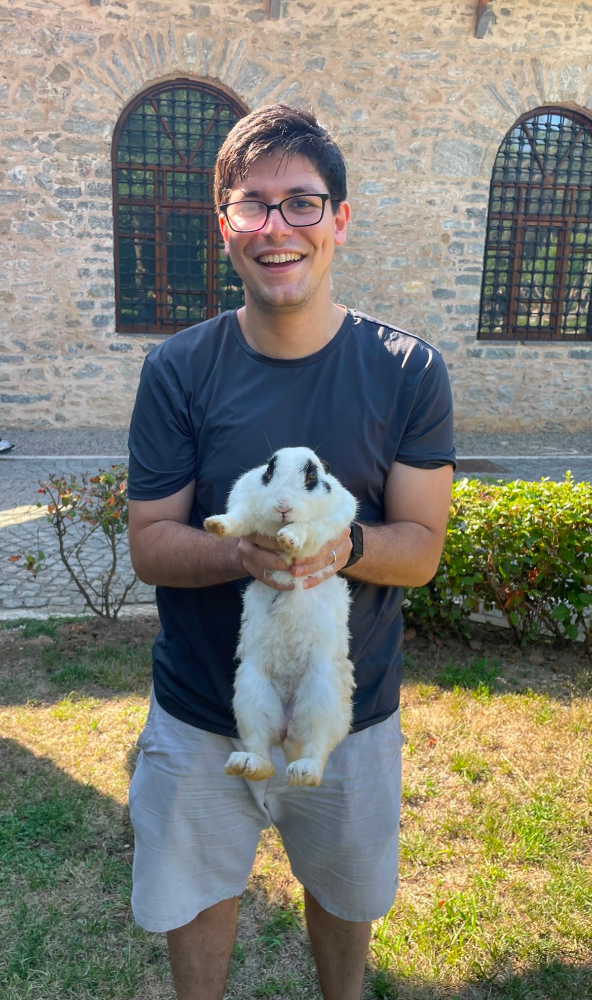

::: {.home-page}
::: {.home-hero}
::: {.home-hero__copy}

Model theory and mathematical logic

<h1 class="home-title">Metin Ersin Arıcan</h1>

Incoming PhD student in Mathematics University of Leeds · October 2026

My research interests are in model theory, particularly geometric stability theory, VC density, and pairs of strongly minimal structures.

I am also interested in formalized mathematics, automated theorem proving, and the use of language models in mathematical research. I completed an M.Sc. in Mathematics at Boğaziçi University and undergraduate degrees in Electrical and Electronics Engineering and Physics.

  <a href="./research.html">Research</a>
  <a href="./cv/index.html">CV</a>
  <a href="mailto:metin.ersin.arican@gmail.com">Email</a>
  <a href="https://github.com/metinersin">GitHub</a>

:::

<figure class="home-portrait">
  
</figure>
:::

::: {.home-current}
::: {.home-current__heading}
<h2>Current research</h2>
:::

::: {.home-current__body}
My M.Sc. research concerns VC density in pairs of models of a strongly minimal theory. My doctoral research will continue in model theory under the supervision of [Pantelis Eleftheriou](https://pelefthe.github.io/), with [Vincenzo Mantova](https://poisson.phc.dm.unipi.it/~mantova/index.html) as secondary supervisor.

<dl class="home-details">

<dt>PhD institution</dt>
<dd>University of Leeds</dd>

<dt>Start date</dt>
<dd>October 2026</dd>

</dl>
:::
:::

::: {.home-selected}
::: {.home-selected__heading}
<h2>Selected work</h2>
:::

:::: {.home-work-list}
::: {.home-work-item}

Research

<h3>VC density in pairs</h3>

My M.Sc. thesis studies combinatorial complexity in expansions of strongly minimal structures.

<a href="./research.html">Research overview</a>

:::

::: {.home-work-item}

Formalization

<h3>Quantifier elimination in Lean</h3>

I worked with a student team to formalize the back-and-forth method and apply it to dense linear orders.

<a href="./research.html#selected-projects">Project details</a>

:::

::: {.home-work-item}

Publication

<h3>ISNAS-DIP</h3>

Our image-specific neural architecture search method appeared at CVPR 2022.

<a href="./research.html#publications">Publication details</a>

:::
::::
:::
:::
